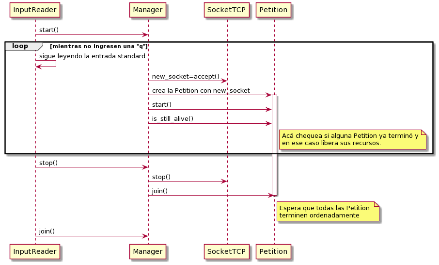

# TP3-Taller Pages

**Apellido y nombre:** Eleonora Luna 
**Padrón:** 96444

**Repositorio de Github:** https://github.com/eleonoraluna/tp3-taller-pages.git

## Informe

### 1. Arquitectura General

#### Client.cpp

Es el main del client el cual recibe un host y un puerto al cual debe conectarse y recibe por
entrada standard un archivo del cual lee el petitorio.

```
    Ej: ./client localhost 8080 <single_get_root.txt
```

El main se encarga de instanciar un Reader y correrlo.

**Clases:**

#### Reader

Esta clase se encarga de ir leyendo el archivo recibido por entrada standard e ir enviando el petitorio
utilizando la clase **Protocol** hasta llegar al EOF del archivo. Una vez que se envía todo el petitorio,
se cierra el canal de escritura y espera la respuesta al petitorio del servidor.

#### Protocol

Es owner del socket TCP que se utiliza para enviar y recibir mensajes al servidor. Ya que en el protocolo
no se especifican la cantidad de bytes que se van recibir antes de recibir el mensaje, se encarga de realizar
un bucle hasta recibir la respuesta completa del servidor. También tiene un método llamado *stop_sending()* que
lo que hace es decirle al **SocketTCP** que cierre el canal de escritura para avisarle al servidor que terminó de
enviar el petitorio.

#### Socket_TCP
Representa un socket para protocolo TCP. Se encarga de recibir y enviar los buffers que le pasan por parámetros. 
También se encarga de asegurarse de que se envíen y reciban todos los bytes correspondientes.
En particular, contiene un método *stop()* que es utilizado cuando el socket aceptador se queda bloqueado en el accept.
Cuando ingresan una "q" por teclado (para finalizar el servidor) el hilo principal hace que el hilo aceptador (que 
es owner de un socket) cierre su socket, de tal manera de no quedarse bloqueado en el accept.

#### Socket_TCPException
Representa las excepciones que se lanzan en la clase Socket_TCP. Éstas son lanzadas cuando surge algún error en los sockets,
tanto como errores de conexión como en el caso de que el send envíe o el recieve reciba 0 bytes. También se lanza una excepción 
cuando se hace un cierre forzado del socket del hilo principal ya que se intentará hacer un accept con un socket cerrado.

#### Server.cpp
Es el main del server el cual recibe un puerto al cual debe conectarse y un archivo del cual lee el contenido del recurso "/".

```
    Ej: ./server 8080 index.html
```

El main se encarga de instanciar un **Manager**, pasárselo al **Input_Reader** y correrlo.

#### Input_Reader
Se encarga de leer de entrada standard si ingresan o no una "q" indicando que se debe terminar la partida.
Tiene una referencia al **Manager** y lo hace correr. En el caso de que ingresen una q, le hace un *stop()* y espera a que termine
haciendole un *join()*.

#### Thread
Clase base de la cual heredan las clases **Manager** y **Petition**. Representa un thread que va a ejecutar la funcion run()
detallada en las clases hijas.

#### Manager
Clase que hereda de thread. Representa al hilo aceptador de clientes. Es owner de un **SocketTCP** el cual utiliza para
ir aceptando clientes. Crea instancias de **Petition** para cada uno de ellos y las corre. Luego, chequea si alguna de las 
peticiones terminó y las elimina y sino, sigue aceptando clientes. Si el **Input_Reader** le hace un *stop()*, cierra su socket 
aceptador y espera a que todas sus Petitions terminen de ejecutarse. Hace uso de una instancia de la clase **RootReader** para leer el archivo que recibió el servidor con el contenido del recurso "/" y agrega el recurso al **ResourceRepository**. Se ejecuta hasta que su variable *isclosed* se marque como true cuando el **Input_Reader** le haga *stop()*. Como puede ser accedida tanto por el **InputReader** como por la clase en sí se la declaró como atómica para que no hayan race conditions.

#### Petition
Clase que hereda de thread. Representa cada conexión individual que hace el server con cada cliente. Se encarga de recibir
la petition que envía el cliente y ejecutarla. Hace uso de una instancia de Decoder para parsear lo que se necesita de cada
petición. Dependiendo el método y el recurso que contenga la petición es la respuesta que se genera del servidor.Para eso, hace 
uso de una instancia de **ResponseFactory** que devuelve la **ServerResponse** correspondiente. También, hace uso de una instacia 
de **ResourceRepository** para chequear si los recursos se encuentran disponibles (en el caso de un GET) o para agregar un nuevo recurso
(en el caso de un POST). Una vez que se obtuvo la respuesta que se tiene que enviar, se la envía mediante un **SocketTCP** al cliente y se marca la variable *is_Alive* como false indicando que la petición terminó de correr. Como esta variable también puede ser accedida por el **Manager** se la declaró como atómica para evitar race conditions.

#### Decoder
Se encarga de decodificar las peticiones que envía el cliente. Parsea todos los parámetros que se necesitan para ejecutar la petición como
el método, el recurso y el cuerpo de la petición. También, parsea la primer linea del petitorio y la imprime.

#### RootReader
Se encarga de leer el archivo que contiene el contenido del recurso "/" y lo guarda en el **ResourceRepository**. En el caso de que 
haya un error al abrir el archivo lanza una **FileErrorException**.

#### FileErrorException
Representa las excepciones que son lanzadas en la clase **RootReader**. Estas se lanzan cuando hubo un error al abrir el
archivo indicado.

#### ResourceRepository
Representa el lugar donde se guardan los recursos con sus contenidos. Como todas las **Petition** tienen una referencia a la misma instancia, se decidió proteger la clase con un mutex para evitar race conditions. Se puede hacer un *get()* indicando el recurso
deseado y se devuelve el contenido del recurso correspondiente. En el caso de que el recurso no se encuentre, el string devuelto se encuentra vacío. También, se puede hacer un *post()* agregando el recurso deseado junto con su contenido.

#### ResponseFactory
Conoce todas las posibles respuestas que puede generar el servidor. Como cada respuesta es distinta y se forma con distintos
parámetros(método,contenido), tiene un método específico para cada mensaje que se quiere generar. Pero, en todos los casos devuelve
una **ServerResponse** que es la clase madre de todos los mensajes específicos que se pueden generar.

#### ServerResponse
Clase base de todos los mensajes que puede generar el servidor.

##### ResourceFound, ResourceNotFound, MethodNotAllowed, ForbiddenOperation, PostSuccessful

Clases que heredan de **ServerResponse**. Representan las respuestas que el servidor puede enviar al cliente.
Cada uno tiene su método *get_response()* que al ser ejecutado devuelve el mensaje que corresponde.

### 2. Diagrama de la solución

A continuación se muestra un diagrama de secuencia de cómo se maneja el cierre ordenado de todos los hilos.
El **Manager** ejecuta la función *is_still_alive()* de cada **Petition** que esté en su lista de peticiones para ver
si alguna ya terminó de ejecutarse. En tal caso, el **Manager** le hace un join y la elimina de la lista. Una vez
que ya ingresaron la letra q, el **InputReader** manda a cerrar el socket del hilo aceptador para que no acepte más 
conexiones y el **Manager** se queda esperando a que todas sus peticiones terminen haciendole un *join()* a cada una.


<p align="center">

</p>


